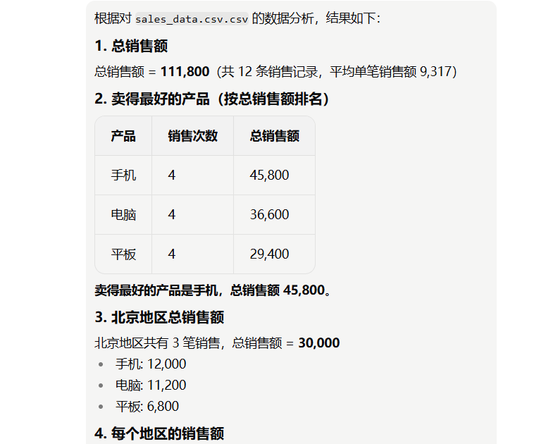

# 智能数据查询助手

## 📌 项目简介
基于 Coze 扣子编程平台搭建的智能数据查询助手，支持上传 CSV/Excel 数据文件，通过自然语言提问进行数据查询、统计汇总和智能分析。

## 🛠 技术架构
- **平台**：Coze 扣子编程
- **模型**：doubao-seed-2-0-lite-260215
- **核心工具**：list_data_files、read_data_file、query_data
- **数据格式**：CSV、Excel（xlsx/xls）、JSON

## 📊 功能演示

### 总销售额查询

### 各地区销售额分析

## ✨ 核心能力
- 列出数据文件并预览结构
- 按条件筛选和排序数据
- 统计汇总（求和、平均值、最大/最小值）
- 分组计数和分布分析
- 自动生成数据洞察

## 📁 测试数据
使用 `sales_data.csv` 进行测试，包含字段：日期、产品、销售额、地区。

## 👤 作者
公康宾

## 📅 更新日期
2026年7月21日
